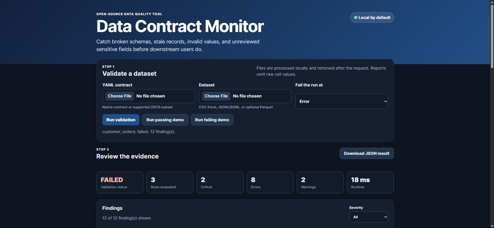
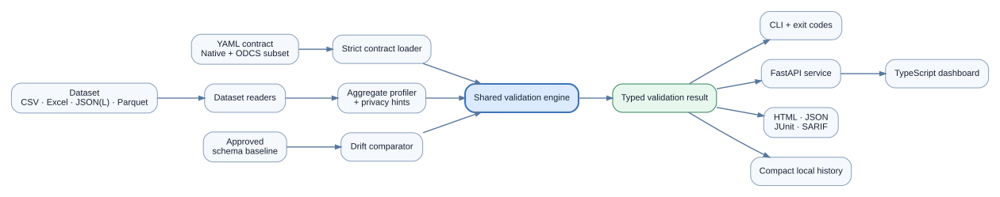

# Data Contract Monitor

**Executable data contracts for files, pipelines, and review workflows.**

Data Contract Monitor validates CSV, Excel, JSON, JSON Lines, and optional Parquet datasets against readable YAML contracts. It produces evidence that people can review and automation can enforce: an accessible HTML report, structured JSON, JUnit XML, SARIF, schema-drift history, and privacy-field hints.

The project is local-first. Uploaded datasets are processed by the local FastAPI service, removed after each request, and never embedded as raw cell values in reports.



## Why this project exists

A broken dataset often remains technically readable. A column can disappear, a business key can duplicate, yesterday's feed can become eight days old, or an unapproved sensitive field can arrive without causing a parser error. Data Contract Monitor turns those expectations into version-controlled rules and makes failures visible before unreliable data reaches a report, model, or operational workflow.

### Demonstrated outcome

The included failing customer-order scenario contains twelve distinct findings across schema, completeness, uniqueness, validity, freshness, and privacy review. The same engine returns zero findings for the passing scenario. Both scenarios require no credentials or private data.

## Try the included demos

On Windows, choose **Extract All** for the release ZIP, open the extracted folder, and double-click:

```text
START_DATA_CONTRACT_MONITOR.bat
```

You need standard 64-bit Python 3.11–3.14. The first launch installs dependencies inside the extracted folder and opens a local dashboard; internet access is needed for that installation. If another app is using the preferred port, the launcher selects an available one. In the dashboard:

1. Select **Run passing demo** to see a clean contract result.
2. Select **Run failing demo** to see actionable findings and privacy hints.
3. Filter by severity, inspect the aggregate profile, and download the JSON evidence.

For a command-line demonstration:

```text
RUN_DEMO.bat
```

Linux and macOS:

```bash
sh tools/start.sh
```

Detailed reviewer steps are in [docs/RECRUITER_REVIEW.md](docs/RECRUITER_REVIEW.md). Windows startup recovery is documented in [docs/WINDOWS_STARTUP_TROUBLESHOOTING.md](docs/WINDOWS_STARTUP_TROUBLESHOOTING.md).

## Runtime folders

Support ZIPs and validation evidence stay inside the project:

- `exports/` — manual support ZIPs and automatic Critical Export20 ZIPs.
- `diagnostics/crash_capsules/` — small local crash records used as evidence when startup or runtime fails.
- `logs/`, `state/`, and `reports/` — readable operating evidence and validation results.

Earlier release folders are left untouched during an upgrade.

## Core capabilities

| Capability | Evidence |
|---|---|
| Executable YAML contracts | Required columns, types, nullability, uniqueness, ranges, length, patterns, approved values, and freshness |
| Dataset-level rules | Row-count ranges, composite uniqueness, null-ratio limits, and conditional completeness |
| Schema-drift monitoring | Approved baselines with added, removed, type, and observed-nullability changes |
| Privacy-field review | Heuristic name and sampled-pattern signals; reports contain counts, never raw values |
| Multiple interfaces | Shared engine behind CLI, Python package, FastAPI service, TypeScript dashboard, and GitHub Action |
| CI evidence | Exit codes, JUnit XML, and SARIF 2.1.0 |
| Reviewer safety | Passing and failing generated demos; no credentials required |
| Release integrity | Version, package metadata, manifest, and managed-file SHA-256 agreement in release mode |
| Failure diagnostics | Bounded redacted Critical crash capsule and Export20 support package in the single project-local `exports/` directory |

## Contract example

```yaml
dataset:
  name: customer_orders
  required_columns:
    - order_id
    - customer_id
    - order_date
    - total_amount
  allow_extra_columns: false

rules:
  order_id:
    type: string
    nullable: false
    unique: true
    pattern: '^ORD-[0-9]{4,}$'
    severity: critical
  total_amount:
    type: number
    nullable: false
    minimum: 0
  order_date:
    type: datetime
    maximum_age_hours: 48

privacy:
  detect_pii: true
  allowed_categories: [account_identifier]
  fail_on_unapproved: false
```

The complete example is [examples/contracts/customer_orders.yml](examples/contracts/customer_orders.yml). A documented subset of the Open Data Contract Standard v3.1 format is also supported; see [examples/contracts/customer_orders.odcs.yaml](examples/contracts/customer_orders.odcs.yaml).

## Command line

Install from the repository:

```bash
python -m pip install .
```

Validate a dataset:

```bash
data-contract-monitor validate \
  --contract examples/contracts/customer_orders.yml \
  --data path/to/customer_orders.csv \
  --formats html,json,junit,sarif \
  --fail-on error
```

Useful commands:

```bash
data-contract-monitor demo --scenario good
data-contract-monitor demo --scenario bad
data-contract-monitor profile --data path/to/data.csv
data-contract-monitor baseline create --contract contract.yml --data approved.csv --output baseline.json
data-contract-monitor baseline compare --data new.csv --baseline baseline.json
data-contract-monitor doctor
data-contract-monitor export-support
```

A reproducible drift example is included:

```bash
data-contract-monitor baseline compare \
  --data examples/data/customer_orders_schema_drift.csv \
  --baseline examples/baselines/customer_orders.schema.json
```

It reports the added `sales_channel` column as a warning and the removed `status` column as an error.

### Exit codes

| Code | Meaning |
|---:|---|
| `0` | Contract passed at the selected threshold |
| `2` | Data-quality findings met or exceeded the selected failure threshold |
| `3` | Contract, input, or report configuration prevented validation |
| `4` | Internal, startup, or release-integrity failure |
| `130` | User cancellation |

A data-quality failure is deliberately different from an execution failure. CI can therefore distinguish “the tool broke” from “the data broke its contract.”

## Python API

```python
from pathlib import Path

from data_contract_monitor.engine import validate_files

result = validate_files(
    contract_path=Path("contract.yml"),
    data_path=Path("dataset.csv"),
    record_history=False,
)

print(result.summary.status)
for finding in result.findings:
    print(finding.severity, finding.rule_id, finding.message)
```

## FastAPI service

```bash
data-contract-monitor serve --host 127.0.0.1 --port 8765
```

The default host is loopback-only. Port `8765` is preferred and a bounded higher-port fallback is used when it is occupied; pass `--port-search-limit 0` to require the exact requested port. The browser is identity-gated and cannot open an unrelated service merely because it owns the preferred port. API documentation is available locally at `/docs`. Upload limits are 1 MB for a contract and 50 MB for a dataset. Temporary uploads are deleted when the request ends.

## GitHub Action

A repository using this tool can call the included composite action:

```yaml
- uses: Jnapier2/data-contract-monitor@v0.1.4
  with:
    contract: contracts/customer_orders.yml
    data: data/customer_orders.csv
    fail-on: error
    formats: json,junit,sarif
```

The action definition is [action.yml](action.yml). For production automation, pin the action to a reviewed commit rather than a moving branch.

## Architecture



All interfaces call one validation engine and one Pydantic result model. This prevents the dashboard, CLI, API, and CI integrations from developing different rule semantics. See [docs/ARCHITECTURE.md](docs/ARCHITECTURE.md).

## Testing and verification

The automated suite covers native and ODCS contracts, rule families, file readers, privacy-safe profiling, drift, history, report formats, API endpoints, CLI exit codes, release integrity, diagnostics, port collisions, browser readiness, dashboard assets, and preservation of user files.

```bash
RUN_TESTS.bat
```

or:

```bash
python -m pytest
```

Check [VERIFICATION_REPORT.md](VERIFICATION_REPORT.md) for the tested artifact, environment, and remaining limitations. A historical synthetic measurement is documented separately in [BENCHMARK_REPORT.md](BENCHMARK_REPORT.md); it is not a claim about performance on every computer or workload.

## Security and privacy

Data Contract Monitor is a validator, not a data-loss-prevention product. Privacy detection is heuristic and requires human review. The project does not send datasets over the network, but first-run dependency installation can contact the configured Python package index. The Windows bootstrap requests binary wheels only and does not compile dependencies locally. Reports intentionally include filenames, hashes, aggregate statistics, rule messages, and bounded row numbers—not raw cell values.

Read [SECURITY.md](SECURITY.md) and [docs/SECURITY_AND_PRIVACY.md](docs/SECURITY_AND_PRIVACY.md) before exposing the service beyond `127.0.0.1` or processing regulated data.

## Documentation

- [Contract reference](docs/CONTRACT_REFERENCE.md)
- [Architecture and data flow](docs/ARCHITECTURE.md)
- [Security and privacy](docs/SECURITY_AND_PRIVACY.md)
- [Accessibility review](docs/ACCESSIBILITY.md)
- [Case study and measured outcome](docs/CASE_STUDY.md)
- [Benchmark report](BENCHMARK_REPORT.md)
- [Verification report](VERIFICATION_REPORT.md)
- [Release notes](RELEASE_NOTES.md)
- [Known limitations](docs/KNOWN_LIMITATIONS.md)
- [Demonstration script](docs/DEMO_SCRIPT.md)
- [Release checklist](docs/RELEASE_CHECKLIST.md)
- [Windows startup troubleshooting](docs/WINDOWS_STARTUP_TROUBLESHOOTING.md)
- [Contributing](CONTRIBUTING.md)

## License

Apache License 2.0. See [LICENSE](LICENSE) and [NOTICE](NOTICE).

Copyright © 2026 Gateway Information Group LLC. All rights reserved.
