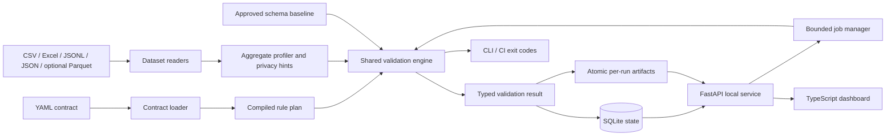

# Architecture

## Design goals

Data Contract Monitor uses one validation engine and one typed result model across CLI, API, dashboard, package, and CI integration. Data-quality failures remain distinct from execution failures. Release-mode startup fails closed when managed identity disagrees, reports avoid raw cell values, and all persistent/runtime paths are derived from the project or application root rather than the current working directory.

## Component map

## Validation execution

The contract is parsed and normalized into a compiled execution plan before dataset evaluation. The plan resolves required/referenced columns and stable rule identifiers and rejects conflicting dataset-rule names. Input byte and table-shape budgets are checked before expensive rule work. Runtime budget checks are cooperative checkpoints between stages rather than a hard process-kill guarantee.

The dashboard submits work to a bounded job manager with one active validation worker and a bounded queue. Job progress, terminal state, and cancellation are persisted in SQLite. The CLI remains synchronous for straightforward CI behavior.

## Durable state and artifacts

SQLite is the authoritative runtime history store under `state/dcm_state.sqlite3`. Schema migrations are versioned; an existing database is backed up with SQLite's backup API, integrity-checked, and SHA-256 receipted before a migration is applied.

Every completed validation has a stable run ID. HTML, JSON, JUnit, and SARIF evidence is first written under root `temp/`, hashed and verified, then atomically moved to `reports/runs/<run_id>/`. Only after successful publication is `state/latest_completed_run.json` atomically updated. This avoids half-written “latest” evidence.

## Security boundaries

Contracts and datasets are untrusted inputs. Unknown contract keys fail closed, accepted file types are bounded, contract/dataset byte limits and row/column limits are declared, and reconciliation expressions use a restricted AST evaluator supporting numeric names and arithmetic only—no calls, attributes, subscripts, imports, or arbitrary `eval`.

The dashboard is a trusted-local workstation surface rather than a multi-user web service. Trusted-host middleware accepts loopback/test hosts, modifying API requests require a random per-launch HttpOnly session cookie, and supplied Origin headers must resolve to an allowed loopback hostname.

## Windows execution map

All user-facing BAT files are logic-free action forwarders. `tools/launch.bat` is the only BAT implementation backend. It derives the root from its own location, clears inherited Python path/home overrides, selects a supported standard 64-bit interpreter, verifies release identity before normal release startup, and routes to bootstrap/doctor/demo/test/repair/export actions. See `docs/PROJECT_STRUCTURE.md`.

## Runtime folders

`config/ logs/ state/ temp/ cache/ exports/ diagnostics/ reports/ downloads/ backups/`

Support and Critical ZIPs finalize only in root `exports/`. Diagnostic capsules stay under `diagnostics/`; temporary export ZIPs stage under root `temp/`. Runtime files are excluded from the managed release manifest.

## Extension boundary

The current reader is file-oriented and pandas-backed. Future streaming readers can implement inspect/iterate semantics without changing the result/report contract. Exact uniqueness or referential-integrity work that exceeds memory should use a disk-backed strategy rather than silently changing to approximate behavior.

Copyright © 2026 Gateway Information Group LLC. All rights reserved.
