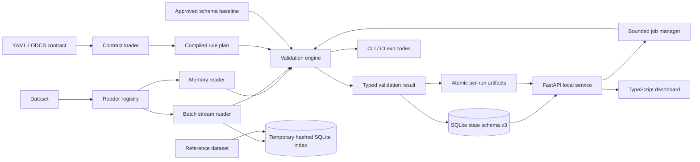

# Architecture

## Design goals

Data Contract Monitor uses one typed contract, one compiled rule plan, and one validation result model across CLI, API, dashboard, package, and CI integration. Data-quality failures remain distinct from execution failures. Release-mode startup fails closed when managed identity disagrees, reports avoid raw cell values, and persistent/runtime paths are derived from the project/application root rather than the current working directory.

## Component map

## Execution model

The contract is parsed and normalized into a compiled execution plan before dataset evaluation. The plan resolves required/referenced columns and stable rule identifiers and rejects conflicting dataset-rule names.

`auto` chooses bounded streaming for sufficiently large CSV/JSONL/NDJSON inputs and memory execution otherwise. `memory` and `streaming` can be selected explicitly. Both paths produce the same typed result/report contract.

Streaming rule evaluation remains exact for supported rules. Single-column uniqueness, composite uniqueness, and cross-dataset reference membership use a temporary SQLite index that stores SHA-256 key material rather than raw values. General profile cardinality is independently bounded and labels lower-bound counts as non-exact when its tracking budget is reached.

Runtime/file/shape/report budgets are checked before and during expensive work. Timeouts and cancellation are cooperative stage/batch checkpoints, not process-kill guarantees.

## Reader extension boundary

Built-ins cover CSV, Excel, JSON, JSONL/NDJSON, and optional Parquet. Reader plugins are discovered through the `data_contract_monitor.readers` Python entry-point group. A failed optional plugin does not disable built-ins. Plugins must obey the caller's resource/security contract; network access is not implicitly authorized.

## Durable state and artifacts

SQLite is authoritative runtime history under `state/dcm_state.sqlite3`. Schema v3 records jobs, validation runs, findings, exact contract identity/version, profiles, drift events, and report artifacts. Existing databases are backed up through SQLite's backup API, integrity-checked, and SHA-256 receipted before migration.

Every completed validation has a stable run ID. HTML, JSON, JUnit, and SARIF evidence is first written under root `temp/`, hashed and verified, then atomically moved to `reports/runs/<run_id>/`. Only after successful publication is `state/latest_completed_run.json` atomically updated.

## Security boundaries

Contracts and datasets are untrusted input. Unknown contract keys fail closed. Accepted file types and content signatures are checked, YAML/data bytes and shape are bounded, JSON nesting is bounded, regex length is bounded, and reconciliation expressions use a restricted AST evaluator supporting numeric names and arithmetic only—no calls, attributes, subscripts, imports, or arbitrary `eval`.

The dashboard is a trusted-local workstation surface rather than a multi-user web service. Trusted-host middleware accepts loopback/test hosts, modifying API requests require a random per-launch HttpOnly session cookie, and supplied Origin headers must resolve to an allowed loopback hostname. Uploaded reference datasets are accepted only when declared by the uploaded contract and are mapped to a path that remains inside that job's isolated temporary workspace.

## Windows execution and offline dependency boundary

All user-facing BAT files are logic-free action forwarders. `tools/launch.bat` is the only BAT implementation backend. It derives the root from its own location, clears inherited Python path/home overrides, selects a supported standard 64-bit interpreter, verifies release identity before normal release startup, and routes to bootstrap/doctor/demo/test/repair/export actions.

Bootstrap normally installs exact locked dependencies. If a matching `packages/wheelhouse/cpXY-win_amd64/WHEELHOUSE_MANIFEST.json` exists and every listed wheel hash verifies, bootstrap switches to `--no-index --find-links` offline installation. Incomplete or tampered wheelhouses are ignored rather than trusted. `tools/build_windows_wheelhouse.py` is the explicit builder; v0.3.3 does not claim a wheelhouse was built in the network-restricted Linux environment.

## Runtime folders

`config/ logs/ state/ temp/ cache/ exports/ diagnostics/ reports/ downloads/ backups/`

Support and Critical ZIPs finalize only in root `exports/`. Diagnostic capsules stay under `diagnostics/`; temporary export ZIPs stage under root `temp/`. Runtime files are excluded from the managed release manifest.

Copyright © 2026 Gateway Information Group LLC. All rights reserved.
