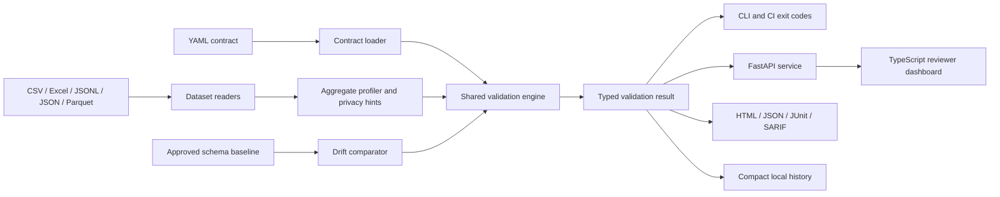

# Architecture

## Design goals

Data Contract Monitor is designed around five constraints:

1. One rule engine must serve every interface.
2. A data-quality failure must be distinguishable from a program failure.
3. Reports must be useful without reproducing raw dataset values.
4. The source ZIP must launch from any extracted path, including paths containing spaces.
5. Release identity must fail closed before normal release startup when managed files disagree.

## Component map



The rendered diagram is available at [assets/architecture.svg](assets/architecture.svg).

## Data flow

1. The contract loader parses native YAML or adapts the supported ODCS v3.1 subset into the same internal contract model.
2. The reader loads one tabular file into a pandas `DataFrame`.
3. The profiler calculates counts, observed logical types, cardinality, numeric aggregates, and heuristic privacy signals.
4. The optional drift comparator compares the current profile to a reviewed baseline.
5. The engine evaluates column and dataset rules and emits deterministic finding identifiers.
6. The summary applies the configured `fail_on` threshold.
7. Reporters serialize the same result model into human-readable and machine-readable formats.
8. History records only compact operational evidence: hashes, counts, status, runtime, and run ID.

## Boundaries

### Trusted application code

- Contract parsing and validation
- Dataset readers
- Rule evaluation
- Report generation
- Local history and diagnostics

### Untrusted inputs

- Uploaded contracts
- Uploaded datasets
- Excel sheet names
- ODCS object selector

Unknown contract keys fail closed. Dataset file extensions are allow-listed. The service bounds request sizes and uses request-scoped temporary directories.

## Failure model

| Failure class | Behavior |
|---|---|
| Contract violations | Structured findings; exit code `2` when threshold is met |
| Invalid contract or unreadable input | Clear configuration error; exit code `3` |
| Release identity mismatch | Startup denied in release mode; exit code `4`; read-only support export remains available |
| Uncaught terminal failure | Atomic minimal crash capsule, then one bounded redacted full export when budgets permit |
| Normal cancellation | Exit code `130`; no automatic Critical export |

## Storage model

A source or Windows ZIP uses root-relative folders derived from the launcher location:

```text
config/ logs/ state/ temp/ cache/ exports/ diagnostics/ reports/ downloads/ backups/
```

The root `exports/` directory is the only destination for support and Critical diagnostic ZIPs. `diagnostics/` stores capsules, suppression counts, and transient exporter state, but never a second export directory.

An installed Python package uses `DCM_HOME` when set. Otherwise it uses the operating system's user-local application state directory. It never derives persistent storage from the current working directory, Desktop, or Downloads.

## Extension points

New rule types should implement three things together:

1. A strictly validated contract model field or dataset-rule variant.
2. A rule evaluator that emits the common `Finding` model.
3. Tests covering pass, fail, null, malformed configuration, and report serialization.

Connectors to warehouses or catalog systems are intentionally outside the first release. They can later produce a `DataFrame` or an intermediate profile without changing report semantics.
